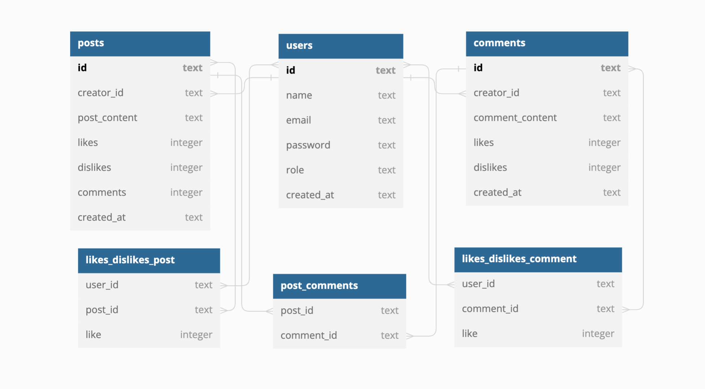

# 📲 Labeddit FullStack Project - Backend 


🚩 [Labeddit FullStack Project - Frontend](https://github.com/LATerada/labeddit-fullstack-project-frontend)

This project is a social network with the objective of promoting connection and interaction between people. Those who register in the application will be able to create, like or dislike publications, and write, like or dislike comments!

The project was developed from the creation of an API, interaction with the database, implementation of security and scalable codes.

## 📱 Project Funcionalities

* Signup / Login
* Create Posts
* Create Comments
* Like / Dislike Posts
* Like / Dislike Comments

## 📚 Technologies Used

- NodeJS
- Typescript
- Express
- SQL and SQLite
- Knex
- POO
- Layered Architecture
- UUID generation
- Hashes generation
- Authentication and authorization
- Routing
- Postman

## 💿 Database



https://dbdiagram.io/d/64696e74dca9fb07c4752ed0

## 📝 Documentation

[Documentation Link](https://documenter.getpostman.com/view/25826593/2s93m1b56w)

## 💻 How to Install and Run the Project

```bash
# Clone this repository
$ git clone linkrepo

# Acesse the folder in you terminal
$ cd labeddit-fullstack-project-backend

# Install dependêncies
$ npm install

# Execute the application
$ npm run start
```


## ✅ Whats was expected in this project

- Endpoints

  * signup
  * login
  * create post
  * getPosts
  * like/dislike post
  * create comment
  * getCommentsByPostId
  * like/dislike comment

- Authentification e authorization

  * UUID identification
  * Hashed password with Bcrypt
  * JWT token

- Code

  * OOP
  * Layered Architecture
  * Express routers

- README.md

## 🙋‍♀️ About Creator

[Linkedin](https://www.linkedin.com/in/larissa-terada/)